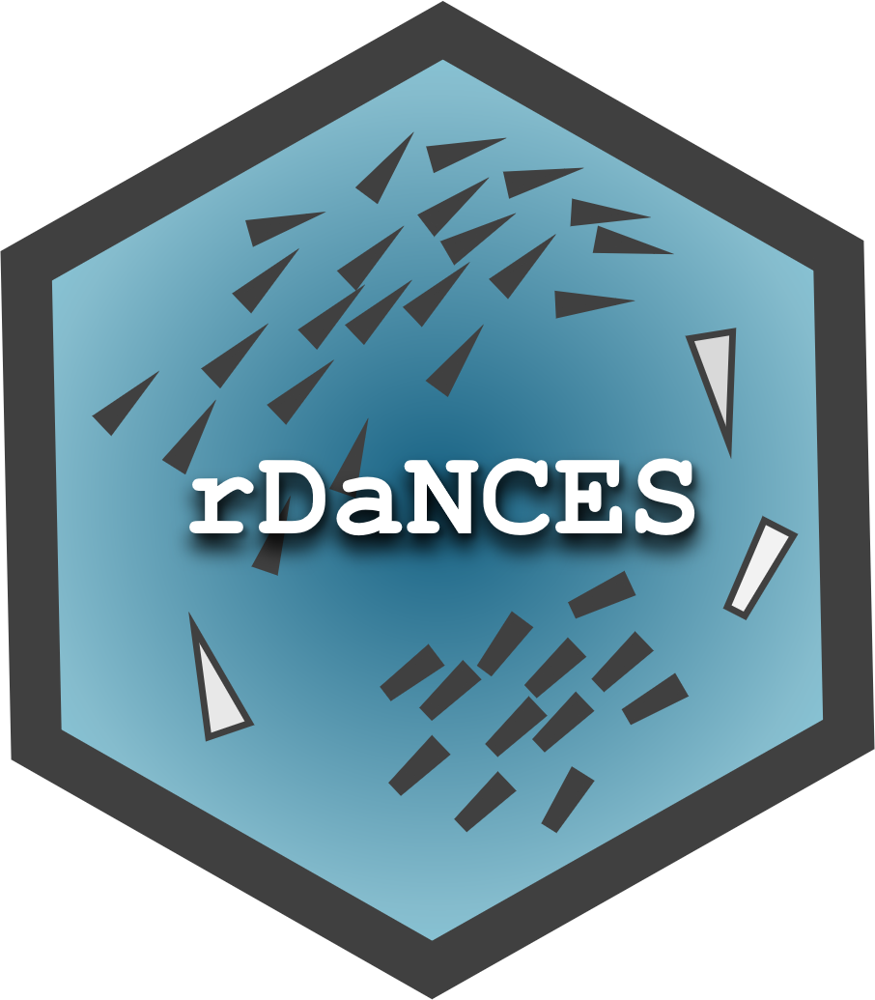

# *rDaNCES*   

## Description 
This R package supports the set up and run of simulations with agent-based models constructed based on the [`DaNCES`](https://github.com/marinapapa/DaNCES_framework) framework (Data-iNspired Collective Escape Simulations). For a proposed repository structure to combine the agent-based model software with this package, see [DaNCES_simulator](https://github.com/marinapapa/DaNCES_simulator). 
[`rDaNCES`](https://github.com/marinapapa/rDaNCES) is a work in progress, and it aims to help users kick-off the simulation runs and analysis of their simulated data. For extention inquiries please get in touch.  

Overall the package uses a config file as a template (a full composed *.json* file from DaNCES), sets up the parameter space to be investigated, creates a set of configs for all different parameter combinations (saved in a *generated_configs* folder), runs the defined model (from the directory of the executable) for each config with as many repetitions as the user sets, and then provides some helper functions to start analyzing the simulated data. The executable of a model to be used for the simulations should be stored in an external folder and its path indicated, as shown in the vignette.

## Publication

Further information on the functionality of the framework see our accompanying publication: 

_Papadopoulou M, Hildenbrandt H, Hemelrijk CK. (2025) A data-inspired framework to simulate collective behaviour of predator-prey systems._

## Authors
* **Marina Papadopoulou** - For any problem email at: <m.papadopoulou.rug@gmail.com>
